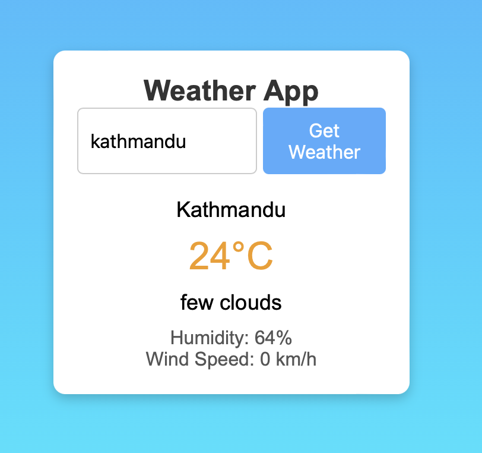
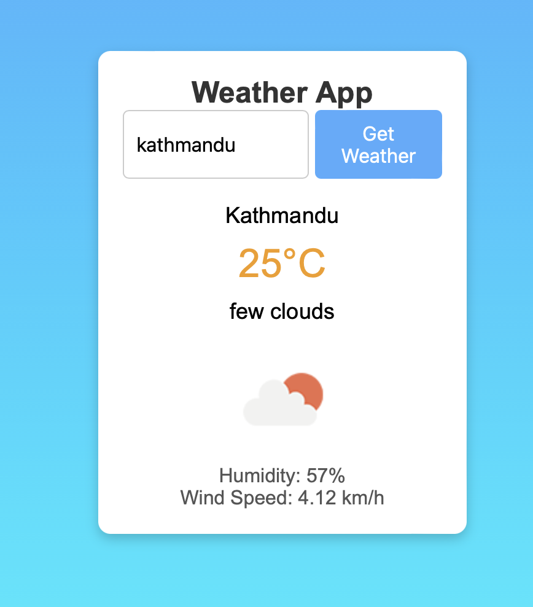

# Weather App

This is a simple weather app built with HTML, CSS, and JavaScript. It fetches and displays real-time weather data using the OpenWeatherMap API.

## Features

- Get current weather information for any city.
- Displays:
  - City name
  - Temperature in Celsius
  - Weather description
  - Humidity
  - Wind speed

## Demo




<!-- Add a screenshot of your app here if desired -->

## Tech Stack

- **HTML5**: For structure and layout.
- **CSS3**: For styling and layout adjustments.
- **JavaScript**: For API handling and DOM manipulation.
- **OpenWeatherMap API**: To fetch real-time weather data.

## Getting Started

To get a local copy of this project up and running, follow these steps:

### Prerequisites

- Sign up at [OpenWeatherMap](https://openweathermap.org/api) to get an API key.

### Installation

1. Clone the repository:

   ```bash
   git clone https://github.com/Devendra-1997/weather-app.git
   cd weather-app
   ```

2. Replace `YOUR_API_KEY` in `script.js` with your OpenWeatherMap API key:

   ```javascript
   const apiKey = "YOUR_API_KEY";
   ```

3. Open `index.html` in a web browser to use the app.

## Usage

1. Enter the name of a city in the input field.
2. Click "Get Weather" to fetch the current weather information.
3. The app will display the temperature, description, humidity, and wind speed for the specified city.

## Project Structure

```
weather-app/
│
├── index.html         # HTML structure of the app
├── style.css          # CSS styling for the app
└── script.js          # JavaScript to fetch and display weather data
```

## Future Improvements

- **Automatic location detection** for fetching weather data based on user's current location.
- **Improved error handling** for cases like incorrect city names.
- **More weather details** such as forecast, pressure, and sunrise/sunset times.

## License

This project is licensed under the MIT License. See the [LICENSE](LICENSE) file for details.

## Acknowledgments

- [OpenWeatherMap](https://openweathermap.org/api) for providing the weather API.
